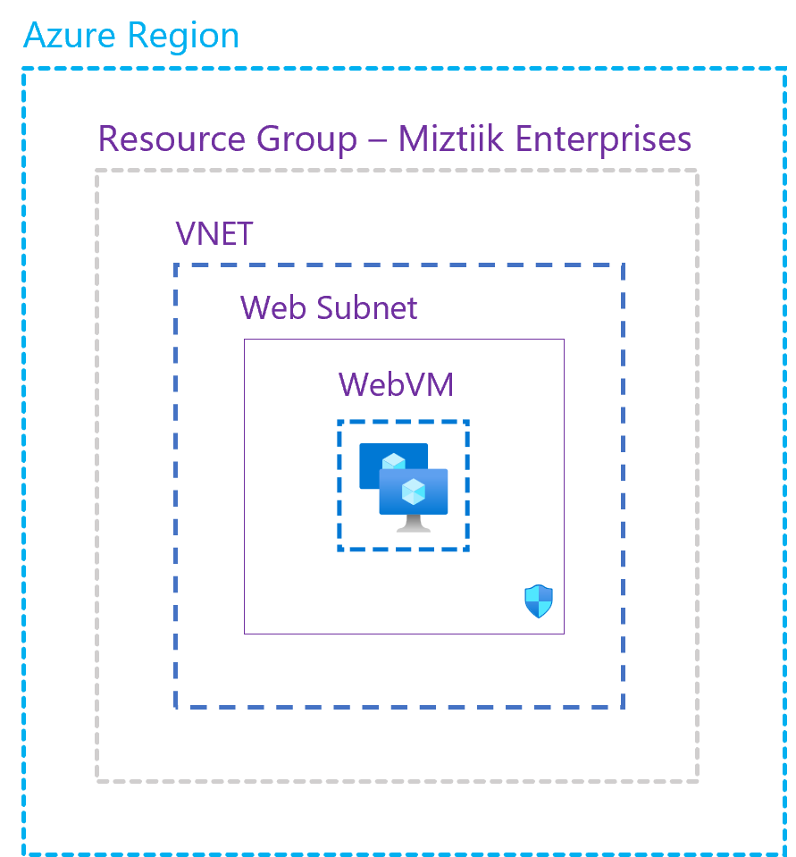

# Create Azure VM

The developer at Mystique Unicorn are looking to build a RG,Vnet, VM(Redhat 9) in Azure using bicep

Can you show them how the can get started ?

## 🎯 Solutions

This repository holds the bicep code to deploy,
- Resource Group
- Virtual Network
- Virtual Machine - RedHat
    - Bootstrapped with custom libs using `customData` script



1. ## 🧰 Prerequisites

   This demo, instructions, scripts and bicep template is designed to be run in `westeurope`. With few or no modifications you can try it out in other regions as well(_Not covered here_).

   - 🛠 Azure CLI Installed & Configured - [Get help here](https://learn.microsoft.com/en-us/cli/azure/install-azure-cli)
   - 🛠 Bicep Installed & Configured - [Get help here](https://learn.microsoft.com/en-us/azure/azure-resource-manager/bicep/install)
   - 🛠 VS Code & Bicep Extenstions - [Get help here](https://learn.microsoft.com/en-us/azure/azure-resource-manager/bicep/install#vs-code-and-bicep-extension)

2. ## ⚙️ Setting up the environment

   - Get the application code

     ```bash
     git clone https://github.com/miztiik/azure-create-vm
     cd azure-create-vm
     ```

3. ## 🚀 Prepare the environment

   Let check you have Azure Cli working with 

    ```bash
      # You should have azure cli preinstalled
      az account show
    ```

    You should see an output like this,

   ```json
    {
      "environmentName": "AzureCloud",
      "homeTenantId": "16b30820b6d3",
      "id": "1ac6fdbff37cd9e3",
      "isDefault": true,
      "managedByTenants": [],
      "name": "YOUR-SUBS-NAME",
      "state": "Enabled",
      "tenantId": "16b30820b6d3",
      "user": {
        "name": "miztiik@",
        "type": "user"
      }
    }
   ```

4. ## 🚀 Deploying the application

   Let us walk through each of the stacks,

   - **Stack: Main Bicep**
     The helper deployment script `deploy.sh` will deploy the `main.bicep` file. This will inturn call the modules for RG,VNet & VM creation

     ```bash
     sh deploy.sh
     ```

     After successfully deploying the stack, Check the `Outputs` section of the stack for the resources.


5. ## 🔬 Testing the solution

   1. **Connect to the VM**

    ```bash
    ssh miztiik@publicIP
    ```

    You should be able to connect to this server on port `22` from the internet. This is should not be the case in production. You would want to secure that with restricted to private IP space or use a bastion or just-in-time access.

      
6. ## 📒 Conclusion

Here we have demonstrated how to bicep to create Resource groups, Vnets and VMs

2. ## 🧹 CleanUp

If you want to destroy all the resources created by the stack, Execute the below command to delete the stack, or _you can delete the stack from console as well_

- Resources created during [Deploying The Application](#-deploying-the-application)
- _Any other custom resources, you have created for this demo_

```bash
# Delete from resource group
az group delete --name Miztiik_Enterprises_001 --yes
# Follow any on-screen prompts
```

This is not an exhaustive list, please carry out other necessary steps as maybe applicable to your needs.

## 📌 Who is using this

This repository aims to show how to Bicep to new developers, Solution Architects & Ops Engineers in Azure.

### 💡 Help/Suggestions or 🐛 Bugs

Thank you for your interest in contributing to our project. Whether it is a bug report, new feature, correction, or additional documentation or solutions, we greatly value feedback and contributions from our community. [Start here](/issues)

### 👋 Buy me a coffee

[](https://ko-fi.com/Q5Q41QDGK) Buy me a [coffee ☕][900].

### 📚 References


1. [Azure Bicep Quickstart: Ubuntu VM][1]


### 🏷️ Metadata


**Level**: 200

[1]: https://learn.microsoft.com/en-us/azure/virtual-machines/linux/quick-create-bicep?tabs=CLI


[100]: https://www.udemy.com/course/aws-cloud-security/?referralCode=B7F1B6C78B45ADAF77A9
[101]: https://www.udemy.com/course/aws-cloud-security-proactive-way/?referralCode=71DC542AD4481309A441
[102]: https://www.udemy.com/course/aws-cloud-development-kit-from-beginner-to-professional/?referralCode=E15D7FB64E417C547579
[103]: https://www.udemy.com/course/aws-cloudformation-basics?referralCode=93AD3B1530BC871093D6
[899]: https://www.udemy.com/user/n-kumar/
[900]: https://ko-fi.com/miztiik
[901]: https://ko-fi.com/Q5Q41QDGK